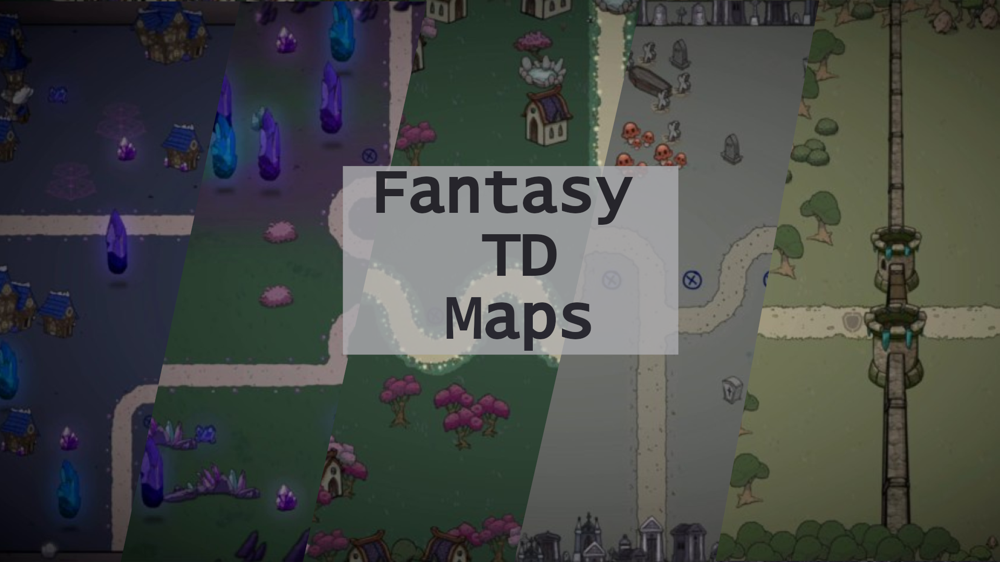

# Unity Asset Support

Welcome! This site hosts documentation, FAQs, and support links for our Unity assets.

## Quick Links
- **Email support:** <a href="mailto:dracblaustudio@gmail.com">dracblaustudio@gmail.com</a>
- **Report a bug:** <a href="https://github.com/alexmartin9/dracblaustudio-assets/issues">GitHub Issues</a>
- **Changelog:** [changelog](./changelog.md)
- **FAQ:** [faq](./faq.md)

---

## Assets

  
- **Fantasy TD Maps** — [docs](./assets/fantasy_td_maps.md) · [FAQ](./faq.md) · <a href="mailto:dracblaustudio@gmail.com">Contact</a>

- **Procedural Paths Generator** — [docs](./assets/procedural_paths_generator.md) · [FAQ](./faq.md) · <a href="mailto:dracblaustudio@gmail.com">Contact</a>

- **Fantasy TD Towers & Projectiles** — [docs](./assets/fantasy_td_towers_projectiles.md) · [FAQ](./faq.md) · <a href="mailto:dracblaustudio@gmail.com">Contact</a>

- **360 Fantasy Relics** — [docs](./assets/fantasy_relics.md) · [FAQ](./faq.md) · <a href="mailto:dracblaustudio@gmail.com">Contact</a>

---

## Support Policy (TL;DR)
- We support the **latest LTS Unity versions**.
- Response time: **1–7 business days**.
- Please include **Unity version**, **repro steps**, and **logs**.
- For refunds, follow the **Unity Asset Store policy** and contact us with your invoice number.

---

_Last updated: {{ site.time | date: "%Y-%m-%d" }}_